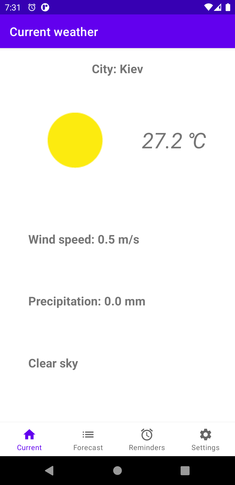
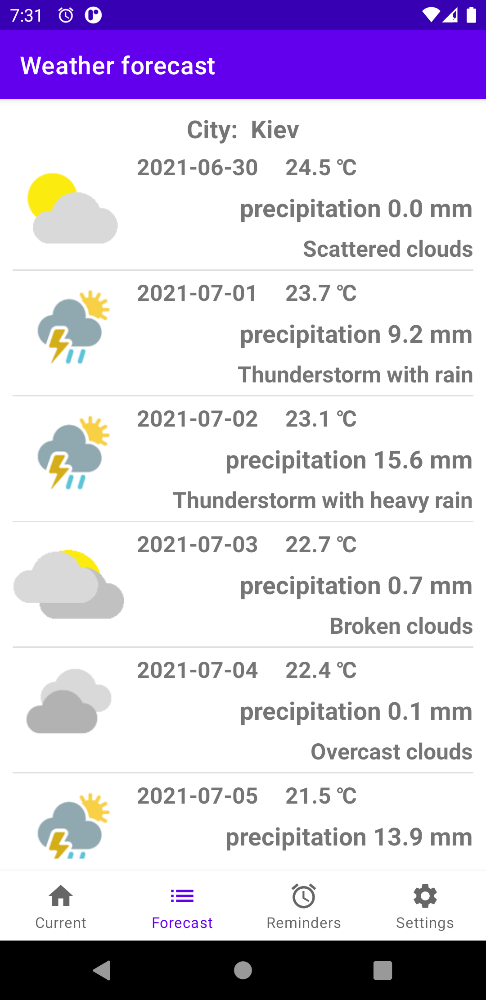
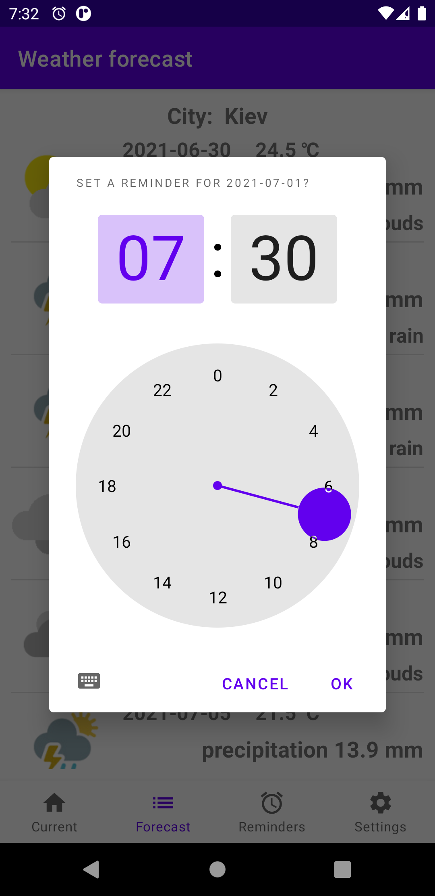
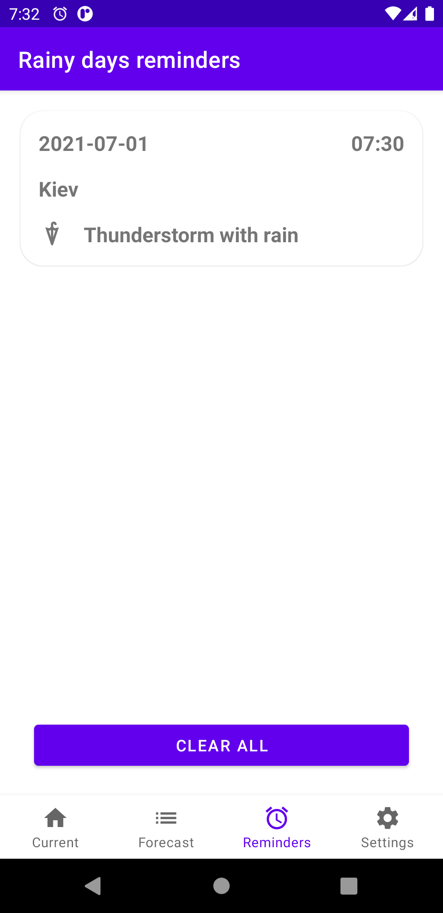
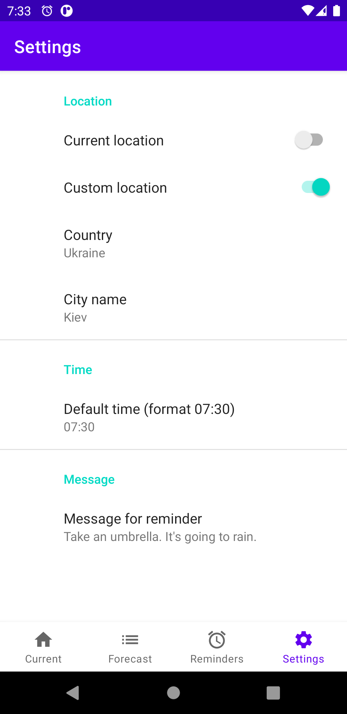
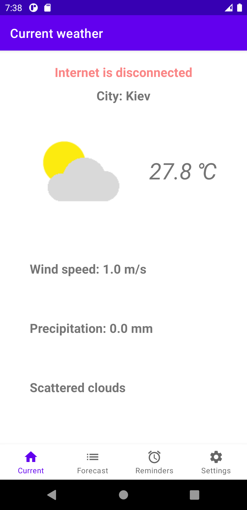
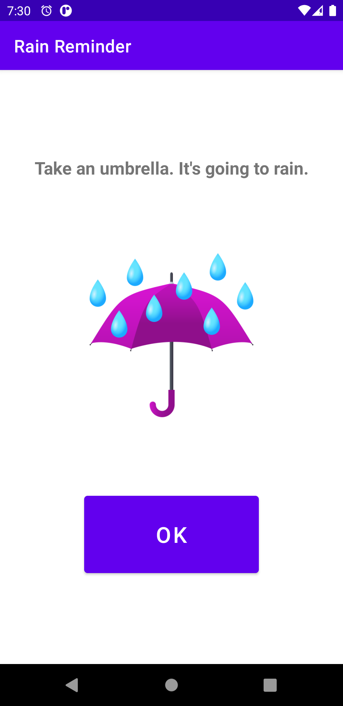

# Rain Reminder - Weather Forecast 

This application is intended to help people to cope with rainy weather. 
By sending automatic notifications about harsh weather conditions and things you might need to deal with them.
Like an umbrella, windbreaker or rain boots.

### Features list:
- rainy day notifications
- location detection automatic or manual
- customizable notification message and time
- easy notification skip - just swipe the notification to the right or use the stop button when the alarm is triggered
- automatic internet connection loss detection and notification.

### Technology:
- Kotlin
- Clean Architecture
- MVVM
- Coroutines
- Dagger
- Room
- Retrofit
- Glide
- Unit tests

## Screenshots:

 

 

